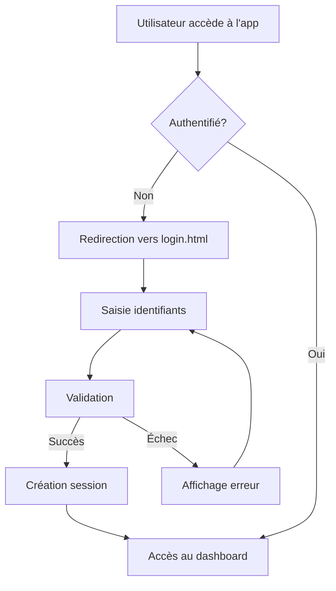

# 🔐 Système d'Authentification CommVulnHunter

## Vue d'ensemble

Ce système d'authentification sécurise l'accès à l'application CommVulnHunter. Il inclut une gestion complète des sessions, des rôles utilisateur et une protection des routes.

## 🚀 Démarrage rapide

### Avec Docker (Recommandé)

```bash
# Démarrer l'application avec authentification
./start-docker.sh

# Ou manuellement :
docker-compose up --build
```

### Accès à l'application

- **URL principale** : http://localhost:8080
- **Page de connexion** : http://localhost:8080/login.html
- **Dashboard** : http://localhost:8080/index.html (protégé)
- **Tests d'authentification** : http://localhost:8080/test-auth.html

## 👥 Comptes de test

| Rôle | Email | Mot de passe | Permissions |
|------|-------|-------------|-------------|
| **Administrateur** | admin@emailfilter.com | admin123 | Toutes les permissions |
| **Utilisateur** | user@emailfilter.com | user123 | Consultation et édition |
| **Démo** | demo@emailfilter.com | demo123 | Consultation uniquement |

## 🛠️ Architecture

### Composants principaux

1. **`auth.js`** - Gestionnaire d'authentification principal
2. **`login.html`** - Page de connexion
3. **`index.html`** - Dashboard principal (protégé)
4. **`test-auth.html`** - Page de test du système d'authentification
5. **`nginx.conf`** - Configuration du serveur web

### Flux d'authentification



## 🔧 Fonctionnalités

### Authentification
- ✅ Connexion sécurisée avec validation côté client
- ✅ Gestion des sessions avec timeout (30 minutes)
- ✅ Option "Se souvenir de moi" (30 jours)
- ✅ Protection contre les attaques XSS et CSRF
- ✅ Déconnexion sécurisée

### Gestion des rôles
- ✅ Système de permissions basé sur les rôles
- ✅ Trois niveaux d'accès (admin, user, demo)
- ✅ Vérification des permissions pour chaque action

### Interface utilisateur
- ✅ Design moderne et responsive
- ✅ Menu utilisateur intégré
- ✅ Affichage des informations de session
- ✅ Messages d'erreur et de succès

### Sécurité
- ✅ Headers de sécurité HTTP
- ✅ Stockage sécurisé des sessions
- ✅ Protection des routes sensibles
- ✅ Validation des entrées utilisateur

## 📁 Structure des fichiers

```
src/
├── pages/
│   ├── login.html          # Page de connexion
│   ├── index.html          # Dashboard principal
│   ├── auth.js             # Gestionnaire d'authentification
│   ├── test-auth.html      # Page de test
│   ├── 404.html            # Page d'erreur 404
│   └── 50x.html            # Page d'erreur serveur
├── nginx.conf              # Configuration nginx
└── css/                    # Styles CSS
```

## 🔒 Sécurité

### Mesures de sécurité implémentées

1. **Headers de sécurité**
   - `X-Content-Type-Options: nosniff`
   - `X-Frame-Options: DENY`
   - `X-XSS-Protection: 1; mode=block`
   - `Referrer-Policy: strict-origin-when-cross-origin`

2. **Gestion des sessions**
   - Timeout automatique après 30 minutes d'inactivité
   - Stockage sécurisé en localStorage
   - Validation des tokens de session

3. **Protection des routes**
   - Redirection automatique vers login si non authentifié
   - Vérification des permissions pour chaque action
   - Gestion des erreurs 404 et 5xx

## 🧪 Tests

### Page de test (`test-auth.html`)

La page de test permet de vérifier :
- ✅ Connexion avec différents comptes
- ✅ Gestion des permissions par rôle
- ✅ Fonctionnement des sessions
- ✅ Déconnexion et nettoyage des données

### Tests manuels

1. **Test de connexion**
   ```bash
   # Accéder à http://localhost:8080
   # Vérifier la redirection vers login
   # Tester la connexion avec admin@emailfilter.com/admin123
   ```

2. **Test de protection des routes**
   ```bash
   # Accéder directement à http://localhost:8080/index.html sans être connecté
   # Vérifier la redirection vers login
   ```

3. **Test de session**
   ```bash
   # Se connecter et attendre 30 minutes
   # Vérifier la déconnexion automatique
   ```

## 🔧 Configuration

### Variables d'environnement

Le système utilise les configurations suivantes :

```javascript
// Durée de session (en millisecondes)
sessionTimeout: 30 * 60 * 1000  // 30 minutes

// Durée "Se souvenir de moi" (en millisecondes)
rememberDuration: 30 * 24 * 60 * 60 * 1000  // 30 jours
```

### Personnalisation

Pour modifier les comptes de test, éditez la fonction `authenticateUser` dans `auth.js` :

```javascript
const testUsers = [
    { email: 'votre@email.com', password: 'motdepasse', role: 'admin', name: 'Nom' },
    // ...
];
```

## 🐛 Dépannage

### Problèmes courants

1. **Redirection infinie vers login**
   - Vérifier que `auth.js` est correctement chargé
   - Vérifier la console pour les erreurs JavaScript

2. **Session expirée prématurément**
   - Vérifier l'horloge système
   - Vérifier les paramètres de timeout

3. **Permissions refusées**
   - Vérifier le rôle utilisateur
   - Vérifier la configuration des permissions

### Logs

Pour voir les logs Docker :
```bash
docker-compose logs -f web
docker-compose logs -f fastapi
```

## 📞 Support

Pour toute question ou problème :
1. Vérifier cette documentation
2. Utiliser la page de test `test-auth.html`
3. Consulter les logs Docker
4. Créer une issue sur le repository

## 🔄 Mise à jour

Pour mettre à jour le système :

```bash
# Arrêter les conteneurs
docker-compose down

# Reconstruire avec les nouvelles modifications
docker-compose up --build
```

---

**Note** : Ce système d'authentification est conçu pour des environnements de développement et de test. Pour une utilisation en production, considérez l'ajout d'une authentification serveur et d'une base de données sécurisée.